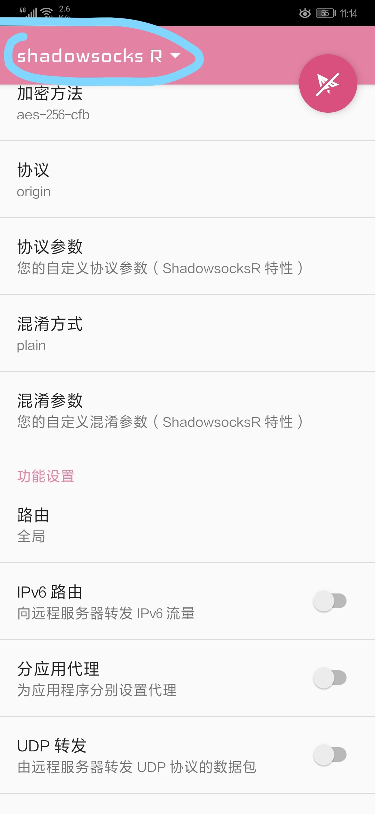
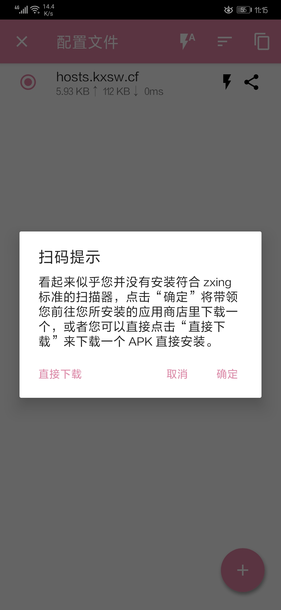
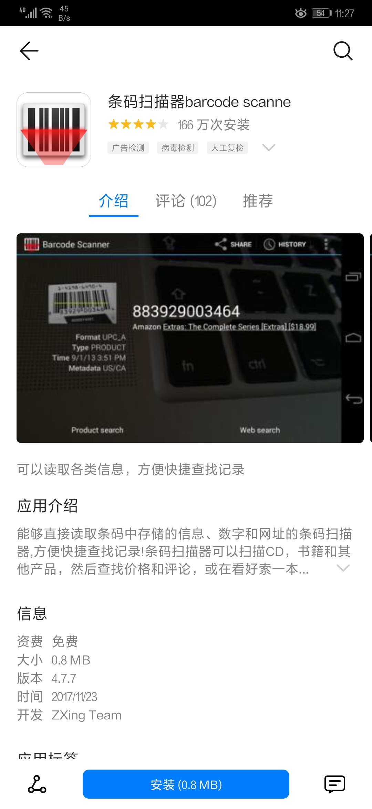
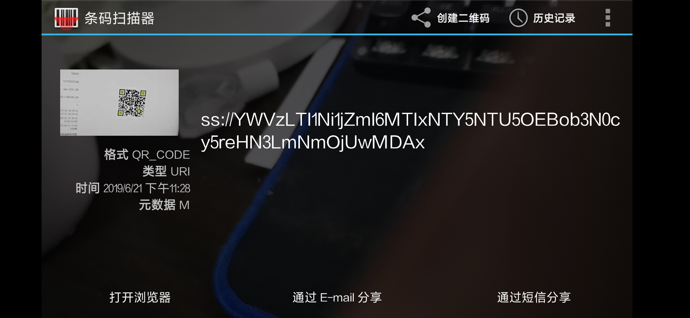
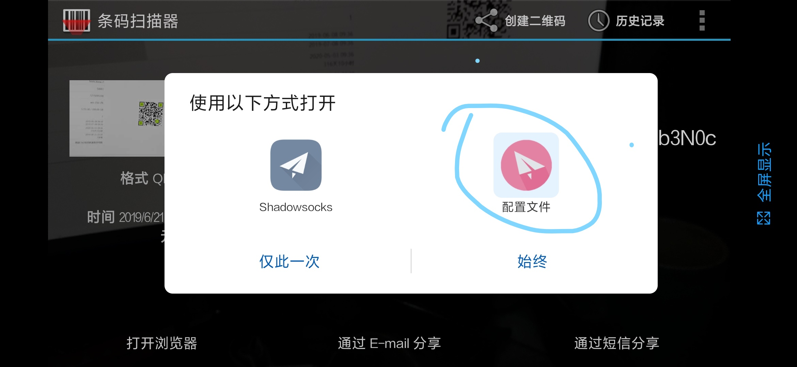
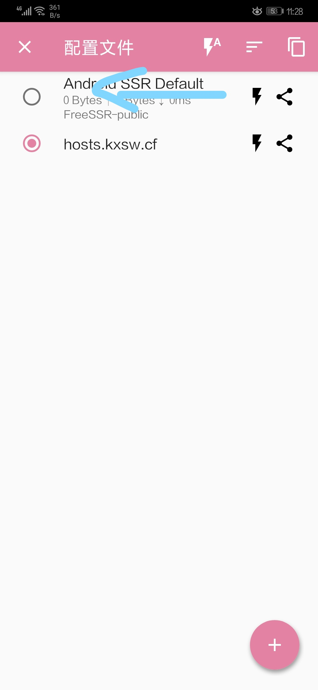
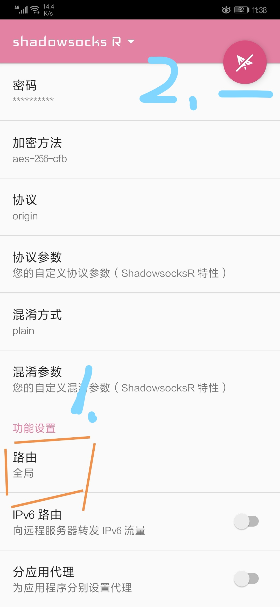

# Android中的Shadowsocks客户端

## 下载和安装

三种方式：
 * 去[科学上网下载安装](https://kxsw2019.cf/guide/ShadowsocksR-3.4.0.8.apk) 可以下载到apk

* 自己去`github`下载`apk`安装包后自己安装

* 从应用市场`Google Play`去搜索并安装
  * [Shadowsocks - Android Apps on Google Play](https://play.google.com/store/apps/details?id=com.github.shadowsocks)

## 初始安装与二维码扫描配置（推荐）
 
 * 1.返回主页面
 	
 	打开ss客户端后，会出现如下：

 	

 	点击左上角返回首页

 * 2.安装二维码扫描器
		
	点击首页上的	`➕`,

	点击`扫描二维码`出现下图：
	
	
	
	点击`确定`，然后选择你的`应用市场`（比如：华为应用市场、豌豆荚等）进行安装二维码扫码器

 	
 * 3.扫描二维码

	扫描网站上的`帐号`页面的二维码，然后通过`打开浏览器`打开：
	
	

	选择刚刚安装的ss客户端：

	

	点击确定。

 * 4.少许配置

 	删除自带我配置，`左滑`删除 `Android SSR Default`:
	
	

	点击我们添加的服务器进去，找到 `功能设置-全局`，改为`绕过局域网及中国大陆地址`:
	
	

 * 5.开始使用	
	
	点击右上角的 `飞机`,等待几秒你就可以畅游`真正`互联网

### 手动添加配置（旧版。）

所以此处为了能正常添加配置，建议用`手动设置`的方式去添加ss服务器配置。

点击`手动配置`后，填写如下信息：

* ss服务的配置：
  * `配置名称`：可选，比如填写`hk1 1.00`，表示节点名和流量费率，方便区分不同节点
  * `服务器`：ss服务器的地址
  * `远程端口`：ss服务器的端口
  * `密码`：ss的密码
    * 自建ss服务器或者购买的ss服务器，都会提供相关密码给你的
  * `加密方式`：比如最新的：`chacha20-ietf-poly1305`
    * 
* 其他软件的配置
  * `路由`：默认是`全局`，建议改为：`绕过局域网和中国大陆地址`
    * 

填写配置后如下：

按照同样方式，去添加其他节点的服务器配置。

### 开始使用

点击`选中`某个服务器节点（左边会有竖向的绿色提示），点击右下角`纸飞机按钮`去连接，连接后：

点击`已连接，点击测试连接`去测试速度如何：

就表示可以使用了，同时系统通知中也会有VPN和流量的提示：

然后就可以愉快的科学上网了，比如：

去用`youtube`看视频：

去用手机浏览器上`google`查资料：

