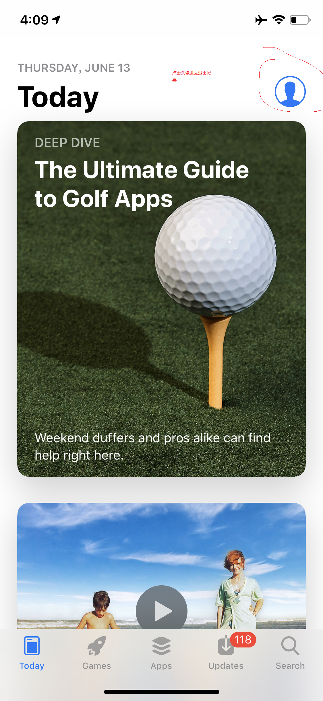
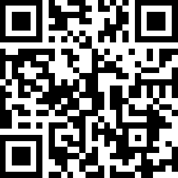
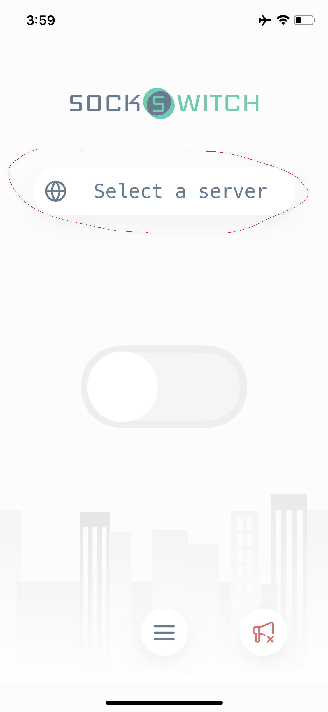
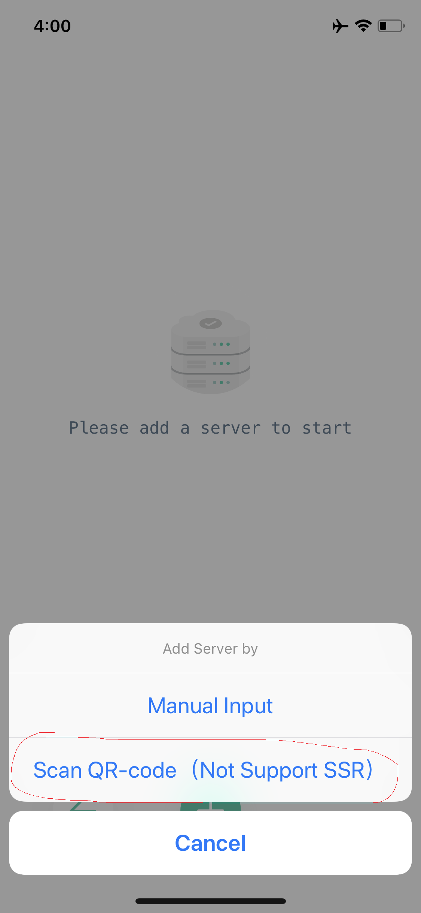

# iOS中的Shadowsocks客户端

## 第三方助手安装（推荐）
* 通过第三方助手安装
  * 下载爱思助手到电脑。
  * 通过 [科学上网下载](https://www.kxsw.cf/guide/ss.ipa)   下载APP到电脑
  * 手机用数据线连接到电脑
  * 通过爱思助手安装下载的APP
  * 相关通过第三方助手安装app教程：[爱思官方教程](https://www.i4.cn/news_detail_3339.html)

## 通过appStore安装
**需要联系我提供美区的apple ID**
* 退出你的apple ID 
 
  
* 登录提供的美区ID
* 下载app，扫描二维码

 
 
* 退出美区ID，重新登录你的APPLE ID

* 使用
 
 添加服务器，这里的二维码是网站-帐号-右边的二维码
 
 
 
 开始使用
 
 
 
 

 

